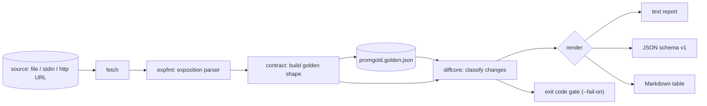

# promgold

[English](README.md) | [中文](README.zh.md) | [日本語](README.ja.md)

[](LICENSE) [](go.mod) [](CHANGELOG.md)  [](CONTRIBUTING.md)

**promgold：Prometheus の /metrics 露出面——メトリクス名・型・ラベル・ヒストグラムバケット——をスナップショットテストする、オープンソースでゼロ依存の CLI。改名されたラベルが数週間後にアラートを静かに殺す代わりに、今日 CI を落とす。**


```bash
git clone https://github.com/JaydenCJ/promgold && cd promgold
go build -o promgold ./cmd/promgold    # single static binary, stdlib only
```

> プレリリース：v0.1.0 はまだどのパッケージレジストリにも公開されていません。上記の手順でソースからビルドしてください（Go ≥1.22 で可）。

## なぜ promgold？

あなたの `/metrics` エンドポイントは、沈黙した消費者を抱えた API です：組織内のすべてのダッシュボードパネル、recording rule、アラートが、正確なメトリクス名・ラベルキー・バケット境界でそこへクエリしています。しかしその露出面を守るものは何もありません。「クリーンアップ」PR で `code` を `status_code` に改名すれば、すべての `sum by (code)` は空を返します——エラーも通知もなく、次のインシデントの際に誰かが気づくフラットな線だけが残る。既存ツールはこの領域をカバーしません：`promtool check metrics` は単一スナップショットの命名規約 lint のみで 2 つの版を比較せず、OpenMetrics バリデータはワイヤフォーマットの構文だけを検査し、汎用のゴールデンファイルライブラリは生のサンプル値を diff してスクレイプのたびに失敗します。promgold は exposition をバージョン管理された契約として扱います：`snap` がそれを決定的なゴールデンファイルへ凝縮し（形状のみ——名前・型・単位・ラベルキー・バケット・分位数・pin した値——測定値は決して含まない）、`check` が再スクレイプして全逸脱を影響半径で分類し、具体的な運用上の帰結を引用しながら CI を失敗させます。

| | promgold | promtool check metrics | OpenMetrics バリデータ | 汎用スナップショットライブラリ |
|---|---|---|---|---|
| 2 つの exposition / 版を diff | ✅ | ❌ 単一スナップショット | ❌ 単一スナップショット | ✅ 生バイト |
| 値のドリフトを無視（形状のみ） | ✅ | n/a | n/a | ❌ スクレイプ毎に差分 |
| 影響半径で分類（breaking/risky/info） | ✅ | ❌ | ❌ | ❌ |
| ヒストグラム・分位数・OpenMetrics 単位を理解 | ✅ | ✅ lint のみ | ✅ 構文のみ | ❌ |
| 終了コード付き CI ゲート | ✅ | ✅ | ✅ | 実装次第 |
| git diff できるゴールデンファイル | ✅ | ❌ | ❌ | ✅ |
| ランタイム依存 | 0 | Prometheus 一式 | 実装次第 | 言語依存 |

<sub>2026-07-13 時点で確認：promgold は Go 標準ライブラリのみを import。`promtool` は Prometheus のフル配布物に同梱されています。</sub>

## 特徴

- **測定値ではなく形状をロック** — ゴールデンはメトリクス名・型・help・単位・ラベルキー・バケット境界・分位数を固定。サンプル値とタイムスタンプはパース後に破棄され、値のドリフトが check を落とすことは決してない。
- **影響半径ベースの重大度** — メトリクス・ラベル・バケットの削除と型/単位の変更は *breaking*。ラベルの追加は *risky*（既存の全系列を静かに分割し `sum()` の結果を変える）。追加系は *info*。`--fail-on` でゲートを選択。
- **本物の exposition パーサ** — Prometheus テキスト形式の全体に加え OpenMetrics 方言：エスケープ、exemplar、`# UNIT`、`# EOF`、ヒストグラム/サマリ系列の折り畳み、構造的にあり得ない exposition を行番号付きエラーで拒否。
- **ラベル値の pin** — `code="500"` をリテラルで照合するアラートは `--pin code` でその値集合をロック可能。pin していないラベル値は契約に入らないため、デプロイがゴールデンを荒らさない。
- **決定的でレビュー可能なゴールデン** — ソート済みの安定 JSON、バケットは数値順。変化のないエンドポイントを再 snap すれば git diff はゼロ行、意図した変更は通常のコードと同じくレビューに乗る。
- **3 つのレポート形式** — 端末向けの整列テキスト、機械向けの安定 JSON（`schema_version: 1`）、PR コメントにそのまま貼れる Markdown テーブル。
- **ゼロ依存・テレメトリなし** — Go 標準ライブラリのみ。promgold が発行し得る唯一のネットワーク呼び出しは、あなたが入力した metrics URL への GET だけ。

## クイックスタート

```bash
# lock the current surface (runtime metrics ignored, status codes pinned)
./promgold snap --ignore 'go_*' --pin code examples/webapp-v1.metrics
# later, in CI — a file, "-" for stdin, or http://127.0.0.1:PORT/metrics
./promgold check examples/webapp-v2.metrics
```

実際にキャプチャした出力：

```text
promgold check — 6 breaking, 2 risky, 0 informational (4 golden vs 3 current families)

BREAKING  http_request_duration_seconds  histogram bucket le="0.5" removed
BREAKING  http_requests_total            label "code" removed (selectors and by(code) clauses stop matching)
BREAKING  http_requests_total            pinned value code="200" removed
BREAKING  http_requests_total            pinned value code="404" removed
BREAKING  http_requests_total            pinned value code="500" removed
BREAKING  queue_depth                    metric no longer exposed
RISKY     http_requests_total            new label "status_code" (existing series split; sum/avg results change)
RISKY     http_requests_total            new label "tenant" (existing series split; sum/avg results change)

contract: BROKEN — 6 changes at or above fail-on=breaking
```

意図した変更だった？ ゴールデンを更新してコミット（実際の出力）：

```text
$ ./promgold check --update examples/webapp-v2.metrics
updated promgold.golden.json: 3 families locked
```

## 変更の重大度ルール

各変更種別はちょうど 1 つの重大度に対応——ゴールデンファイルの詳細は [docs/golden-format.md](docs/golden-format.md) を参照。

| 変更 | 重大度 | 理由 |
|---|---|---|
| メトリクス削除 | breaking | パネルはフラットになり、アラートは二度と発火しない |
| 型の変更（例：counter → gauge） | breaking | `rate()`/`histogram_quantile()` がゴミを返す |
| ラベルキー削除 | breaking | セレクタと `by()` 句がマッチしなくなる |
| ヒストグラムバケット / 分位数の削除 | breaking | `le="0.5"` に固定されたルールが静かに腐る |
| pin したラベル値の削除 | breaking | `code="500"` をリテラル照合するアラートが盲目になる |
| 単位の変更（OpenMetrics） | breaking | ダッシュボードが誤ったスケールで読む |
| ラベルキー追加 | risky | 既存系列が分割され `sum()`/`avg()` の値が変わる |
| untyped メトリクスが型を得る | risky | クエリはマッチし続ける。意図的に更新を |
| メトリクス / 追跡値の追加、help の変更 | info | 追加的または見た目のみの変化 |

## CLI リファレンス

`promgold [snap|check|diff|version]` — source はファイルパス、stdin を表す `-`、または http(s) URL。終了コード：0 契約は健在、1 契約が破壊、2 使い方エラー、3 実行時エラー。

| フラグ | デフォルト | 効果 |
|---|---|---|
| `--out`（snap） | `promgold.golden.json` | 書き出すゴールデンファイル。`-` で stdout |
| `--golden`（check） | `promgold.golden.json` | 比較対象のゴールデンファイル |
| `--pin LABEL` | — | このラベルの値集合をロック（複数指定可） |
| `--ignore PATTERN` | — | パターンに合うメトリクスを除外、`*` ワイルドカード（複数指定可） |
| `--fail-on` | `breaking` | ゲートレベル：`breaking`・`risky`・`info` |
| `--format` | `text` | `text`・`json`・`markdown` |
| `--update`（check） | オフ | 現在の exposition からゴールデンを書き直す |
| `--timeout` | `10s` | http source のスクレイプタイムアウト |

`check` はゴールデンに記録された `--pin`/`--ignore` オプションを再生するため、CI が snap 時と異なるレンズで比較してしまう事故は起こり得ない。

## 検証

このリポジトリは CI を同梱しません。上記のすべての主張はローカル実行で検証されます：

```bash
go test ./...            # 90 deterministic tests, loopback-only, < 5 s
bash scripts/smoke.sh    # end-to-end CLI check, prints SMOKE OK
```

## アーキテクチャ



## ロードマップ

- [x] v0.1.0 — exposition/OpenMetrics パーサ、決定的ゴールデンファイル、終了コードゲート付き重大度分類 check/diff、pin と ignore パターン、text/JSON/Markdown レポート、90 テスト + smoke スクリプト
- [ ] `promgold init`：Grafana ダッシュボードを走査し、クエリが実際に使うラベルを自動 pin
- [ ] 許容リストファイル（`promgold.accept`）：全体更新なしで特定の変更だけを承認
- [ ] マルチエンドポイント契約（1 ファイルに job ごとのゴールデン）
- [ ] Protobuf exposition 形式のサポート
- [ ] `--since` モード：git リビジョン間でゴールデンを比較

完全なリストは [open issues](https://github.com/JaydenCJ/promgold/issues) を参照。

## コントリビュート

Issue・ディスカッション・PR を歓迎します——ローカルワークフロー（フォーマット、vet、テスト、`SMOKE OK`）は [CONTRIBUTING.md](CONTRIBUTING.md) を参照。入門しやすいタスクは [good first issue](https://github.com/JaydenCJ/promgold/issues?q=is%3Aissue+is%3Aopen+label%3A%22good+first+issue%22) ラベル付き、設計の議論は [Discussions](https://github.com/JaydenCJ/promgold/discussions) で。

## ライセンス

[MIT](LICENSE)
