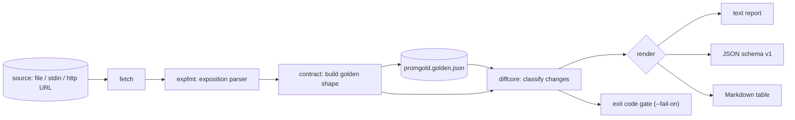

# promgold

[English](README.md) | [中文](README.zh.md) | [日本語](README.ja.md)

[](LICENSE) [](go.mod) [](CHANGELOG.md)  [](CONTRIBUTING.md)

**promgold：an open-source, zero-dependency CLI that snapshot-tests your Prometheus /metrics surface — metric names, types, labels, buckets — so a renamed label breaks CI today instead of killing alerts weeks later.**


```bash
git clone https://github.com/JaydenCJ/promgold && cd promgold
go build -o promgold ./cmd/promgold    # single static binary, stdlib only
```

> Pre-release: v0.1.0 is not tagged on a package registry yet; build from source as above (any Go ≥1.22).

## Why promgold?

Your `/metrics` endpoint is an API with silent consumers: every dashboard panel, recording rule, and alert in your org queries it by exact metric name, label key, and bucket boundary. Yet nothing guards that surface. Rename `code` to `status_code` in a "cleanup" PR and every `sum by (code)` returns empty — no error, no page, just a flat line someone notices during the next incident. The existing tools don't cover this: `promtool check metrics` lints naming conventions on one snapshot but never compares two, OpenMetrics validators check wire-format syntax, and generic golden-file libraries would diff raw sample values, failing on every scrape. promgold treats the exposition as a versioned contract: `snap` condenses it into a deterministic golden file (shape only — names, types, units, label keys, buckets, quantiles, pinned values — never readings), and `check` re-scrapes and classifies every deviation by blast radius, failing CI with the exact operational consequence quoted.

| | promgold | promtool check metrics | OpenMetrics validators | generic snapshot libs |
|---|---|---|---|---|
| Diffs two expositions / versions | ✅ | ❌ single snapshot | ❌ single snapshot | ✅ raw bytes |
| Ignores value drift (shape only) | ✅ | n/a | n/a | ❌ every scrape differs |
| Severity by blast radius (breaking/risky/info) | ✅ | ❌ | ❌ | ❌ |
| Knows histograms, quantiles, OpenMetrics units | ✅ | ✅ lint only | ✅ syntax only | ❌ |
| CI gate with exit codes | ✅ | ✅ | ✅ | varies |
| Git-diffable golden file | ✅ | ❌ | ❌ | ✅ |
| Runtime dependencies | 0 | Prometheus toolchain | varies | language deps |

<sub>Checked 2026-07-13: promgold imports the Go standard library only; `promtool` ships inside the full Prometheus distribution.</sub>

## Features

- **Shape, not readings** — the golden locks metric names, types, help, units, label keys, bucket boundaries, and quantiles; sample values and timestamps are parsed and discarded, so value drift can never fail a check.
- **Blast-radius severities** — removed metrics, labels, buckets, and type/unit changes are *breaking*; an added label is *risky* (it silently splits every existing series and changes `sum()` results); additions are *info*. `--fail-on` picks your gate.
- **Real exposition parser** — full Prometheus text format plus the OpenMetrics dialect: escapes, exemplars, `# UNIT`, `# EOF`, histogram/summary series folding, and line-numbered errors that reject structurally impossible expositions.
- **Pinned label values** — alerts that match `code="500"` literally can lock that value set with `--pin code`; unpinned label values stay out of the contract so deploys don't churn the golden.
- **Deterministic, reviewable goldens** — sorted, stable JSON with buckets in numeric order; re-snapping an unchanged endpoint is a zero-line git diff, and intentional changes review like any other code.
- **Three report formats** — aligned text for terminals, stable JSON (`schema_version: 1`) for machines, and a Markdown table ready to paste into a PR comment.
- **Zero dependencies, no telemetry** — Go standard library only; the sole network call promgold can ever make is a GET to the metrics URL you typed.

## Quickstart

```bash
# lock the current surface (runtime metrics ignored, status codes pinned)
./promgold snap --ignore 'go_*' --pin code examples/webapp-v1.metrics
# later, in CI — a file, "-" for stdin, or http://127.0.0.1:PORT/metrics
./promgold check examples/webapp-v2.metrics
```

Real captured output:

```text
promgold check — 6 breaking, 2 risky, 0 informational (4 golden vs 3 current families)

BREAKING  http_request_duration_seconds  histogram bucket le="0.5" removed
BREAKING  http_requests_total            label "code" removed (selectors and by(code) clauses stop matching)
BREAKING  http_requests_total            pinned value code="200" removed
BREAKING  http_requests_total            pinned value code="404" removed
BREAKING  http_requests_total            pinned value code="500" removed
BREAKING  queue_depth                    metric no longer exposed
RISKY     http_requests_total            new label "status_code" (existing series split; sum/avg results change)
RISKY     http_requests_total            new label "tenant" (existing series split; sum/avg results change)

contract: BROKEN — 6 changes at or above fail-on=breaking
```

The change was intentional? Refresh the golden and commit it (real output):

```text
$ ./promgold check --update examples/webapp-v2.metrics
updated promgold.golden.json: 3 families locked
```

## Change severity rules

Every change kind maps to exactly one severity — full golden-file details in [docs/golden-format.md](docs/golden-format.md).

| Change | Severity | Why |
|---|---|---|
| Metric removed | breaking | Panels flatline, alerts never fire again |
| Type changed (e.g. counter → gauge) | breaking | `rate()`/`histogram_quantile()` return garbage |
| Label key removed | breaking | Selectors and `by()` clauses stop matching |
| Histogram bucket / quantile removed | breaking | Rules pinned to `le="0.5"` go stale silently |
| Pinned label value removed | breaking | Alerts matching `code="500"` literally go blind |
| Unit changed (OpenMetrics) | breaking | Dashboards read the wrong scale |
| Label key added | risky | Existing series split; `sum()`/`avg()` change value |
| Untyped metric gains a type | risky | Queries keep matching; refresh deliberately |
| Metric / tracked value added, help changed | info | Additive or cosmetic |

## CLI reference

`promgold [snap|check|diff|version]` — a source is a file path, `-` for stdin, or an http(s) URL. Exit codes: 0 contract holds, 1 contract broken, 2 usage error, 3 runtime error.

| Flag | Default | Effect |
|---|---|---|
| `--out` (snap) | `promgold.golden.json` | golden file to write; `-` for stdout |
| `--golden` (check) | `promgold.golden.json` | golden file to compare against |
| `--pin LABEL` | — | lock this label's value set (repeatable) |
| `--ignore PATTERN` | — | skip metrics matching pattern, `*` wildcard (repeatable) |
| `--fail-on` | `breaking` | gate level: `breaking`, `risky`, or `info` |
| `--format` | `text` | `text`, `json`, or `markdown` |
| `--update` (check) | off | rewrite the golden from the current exposition |
| `--timeout` | `10s` | scrape timeout for http sources |

`check` replays the `--pin`/`--ignore` options recorded in the golden, so CI can never accidentally compare through a different lens than the snap.

## Verification

This repository ships no CI; every claim above is verified by local runs:

```bash
go test ./...            # 90 deterministic tests, loopback-only, < 5 s
bash scripts/smoke.sh    # end-to-end CLI check, prints SMOKE OK
```

## Architecture



## Roadmap

- [x] v0.1.0 — exposition/OpenMetrics parser, deterministic golden files, severity-classified check/diff with exit-code gate, pinning and ignore patterns, text/JSON/Markdown reports, 90 tests + smoke script
- [ ] `promgold init` scanning Grafana dashboards to auto-pin the labels queries actually use
- [ ] Allowlist file (`promgold.accept`) to acknowledge specific changes without a full refresh
- [ ] Multi-endpoint contracts (one golden per job in a single file)
- [ ] Protobuf exposition format support
- [ ] `--since` mode diffing goldens across git revisions

See the [open issues](https://github.com/JaydenCJ/promgold/issues) for the full list.

## Contributing

Issues, discussions and pull requests are welcome — see [CONTRIBUTING.md](CONTRIBUTING.md) for the local workflow (format, vet, tests, `SMOKE OK`). Good entry points are labelled [good first issue](https://github.com/JaydenCJ/promgold/issues?q=is%3Aissue+is%3Aopen+label%3A%22good+first+issue%22), and design questions live in [Discussions](https://github.com/JaydenCJ/promgold/discussions).

## License

[MIT](LICENSE)
