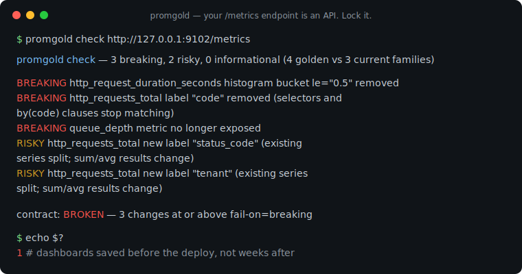
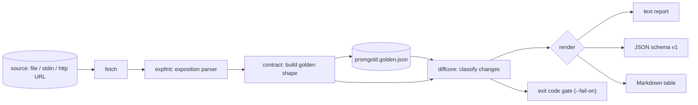

# promgold

[English](README.md) | [中文](README.zh.md) | [日本語](README.ja.md)

[](LICENSE) [](go.mod) [](CHANGELOG.md)  [](CONTRIBUTING.md)

**promgold：开源、零依赖的 CLI，对你的 Prometheus /metrics 暴露面做快照测试——指标名、类型、标签、直方图桶——让改名的标签今天就打断 CI，而不是几周后悄悄杀死告警。**



```bash
git clone https://github.com/JaydenCJ/promgold && cd promgold
go build -o promgold ./cmd/promgold    # single static binary, stdlib only
```

> 预发布：v0.1.0 尚未发布到任何包仓库；请按上述方式从源码构建（Go ≥1.22 即可）。

## 为什么选 promgold？

你的 `/metrics` 端点是一个有着沉默消费者的 API：组织里每一块仪表盘面板、每条 recording rule 和告警，都按精确的指标名、标签键和桶边界去查询它。然而没有任何工具守护这个暴露面。在一次"清理" PR 里把 `code` 改名为 `status_code`，所有 `sum by (code)` 立刻返回空——没有报错，没有告警，只剩一条平线，等下次事故复盘时才被人发现。现有工具覆盖不了这个场景：`promtool check metrics` 只对单份快照做命名规范 lint、从不比较两个版本，OpenMetrics 校验器只检查线格式语法，而通用 golden 文件测试库会去 diff 原始采样值、每次抓取都失败。promgold 把 exposition 当作有版本的契约：`snap` 把它压缩成确定性的 golden 文件（只含形状——名称、类型、单位、标签键、桶、分位数、pin 住的值——绝不含读数），`check` 重新抓取并按爆炸半径给每处偏差分级，让 CI 失败时直接引用确切的运维后果。

| | promgold | promtool check metrics | OpenMetrics 校验器 | 通用快照测试库 |
|---|---|---|---|---|
| 对比两份 exposition / 两个版本 | ✅ | ❌ 单份快照 | ❌ 单份快照 | ✅ 原始字节 |
| 忽略数值漂移（只看形状） | ✅ | n/a | n/a | ❌ 每次抓取都不同 |
| 按爆炸半径分级（breaking/risky/info） | ✅ | ❌ | ❌ | ❌ |
| 理解直方图、分位数、OpenMetrics 单位 | ✅ | ✅ 仅 lint | ✅ 仅语法 | ❌ |
| 带退出码的 CI 门禁 | ✅ | ✅ | ✅ | 视实现而定 |
| 可 git diff 的 golden 文件 | ✅ | ❌ | ❌ | ✅ |
| 运行时依赖 | 0 | Prometheus 全家桶 | 视实现而定 | 语言级依赖 |

<sub>核对于 2026-07-13：promgold 只 import Go 标准库；`promtool` 随完整的 Prometheus 发行版一起分发。</sub>

## 特性

- **锁形状，不锁读数** — golden 锁定指标名、类型、help、单位、标签键、桶边界和分位数；采样值与时间戳解析后即丢弃，数值漂移永远不会让 check 失败。
- **按爆炸半径分级** — 删除指标、标签、桶，以及类型/单位变化是 *breaking*；新增标签是 *risky*（它悄悄拆分每条既有序列并改变 `sum()` 结果）；新增项是 *info*。用 `--fail-on` 选择你的门禁。
- **真正的 exposition 解析器** — 完整的 Prometheus 文本格式加 OpenMetrics 方言：转义、exemplar、`# UNIT`、`# EOF`、直方图/摘要序列折叠，并对结构上不可能的 exposition 报出带行号的错误。
- **pin 住标签值** — 字面匹配 `code="500"` 的告警可用 `--pin code` 锁定该值集合；未 pin 的标签值不进契约，部署就不会搅动 golden。
- **确定性、可评审的 golden** — 排好序的稳定 JSON，桶按数值排序；对未变化端点重新 snap 得到零行 git diff，有意的变更像普通代码一样走评审。
- **三种报告格式** — 终端用对齐文本、机器用稳定 JSON（`schema_version: 1`）、以及可直接粘进 PR 评论的 Markdown 表格。
- **零依赖、无遥测** — 只用 Go 标准库；promgold 唯一可能发出的网络请求，是对你亲手输入的 metrics URL 的一次 GET。

## 快速上手

```bash
# lock the current surface (runtime metrics ignored, status codes pinned)
./promgold snap --ignore 'go_*' --pin code examples/webapp-v1.metrics
# later, in CI — a file, "-" for stdin, or http://127.0.0.1:PORT/metrics
./promgold check examples/webapp-v2.metrics
```

真实捕获的输出：

```text
promgold check — 6 breaking, 2 risky, 0 informational (4 golden vs 3 current families)

BREAKING  http_request_duration_seconds  histogram bucket le="0.5" removed
BREAKING  http_requests_total            label "code" removed (selectors and by(code) clauses stop matching)
BREAKING  http_requests_total            pinned value code="200" removed
BREAKING  http_requests_total            pinned value code="404" removed
BREAKING  http_requests_total            pinned value code="500" removed
BREAKING  queue_depth                    metric no longer exposed
RISKY     http_requests_total            new label "status_code" (existing series split; sum/avg results change)
RISKY     http_requests_total            new label "tenant" (existing series split; sum/avg results change)

contract: BROKEN — 6 changes at or above fail-on=breaking
```

变更是有意的？刷新 golden 并提交（真实输出）：

```text
$ ./promgold check --update examples/webapp-v2.metrics
updated promgold.golden.json: 3 families locked
```

## 变更严重度规则

每种变更类型恰好映射一个严重度——golden 文件的完整细节见 [docs/golden-format.md](docs/golden-format.md)。

| 变更 | 严重度 | 原因 |
|---|---|---|
| 指标被删除 | breaking | 面板变平线，告警永远不再触发 |
| 类型改变（如 counter → gauge） | breaking | `rate()`/`histogram_quantile()` 返回垃圾 |
| 标签键被删除 | breaking | 选择器和 `by()` 子句不再匹配 |
| 直方图桶 / 分位数被删除 | breaking | 钉在 `le="0.5"` 上的规则悄悄失效 |
| pin 住的标签值被删除 | breaking | 字面匹配 `code="500"` 的告警瞬间失明 |
| 单位改变（OpenMetrics） | breaking | 仪表盘按错误的量纲读数 |
| 新增标签键 | risky | 既有序列被拆分；`sum()`/`avg()` 数值改变 |
| untyped 指标获得类型 | risky | 查询仍能匹配；应有意识地刷新 |
| 新增指标 / 跟踪值，help 变化 | info | 增量或纯外观变化 |

## CLI 参考

`promgold [snap|check|diff|version]` — source 可以是文件路径、代表 stdin 的 `-`，或 http(s) URL。退出码：0 契约成立，1 契约被破坏，2 用法错误，3 运行时错误。

| 标志 | 默认值 | 效果 |
|---|---|---|
| `--out`（snap） | `promgold.golden.json` | 要写入的 golden 文件；`-` 表示 stdout |
| `--golden`（check） | `promgold.golden.json` | 用来对比的 golden 文件 |
| `--pin LABEL` | — | 锁定该标签的值集合（可重复） |
| `--ignore PATTERN` | — | 跳过匹配该模式的指标，`*` 通配（可重复） |
| `--fail-on` | `breaking` | 门禁级别：`breaking`、`risky` 或 `info` |
| `--format` | `text` | `text`、`json` 或 `markdown` |
| `--update`（check） | 关 | 用当前 exposition 重写 golden |
| `--timeout` | `10s` | http source 的抓取超时 |

`check` 会重放 golden 里记录的 `--pin`/`--ignore` 选项，因此 CI 永远不会意外地用与 snap 不同的视角做比较。

## 验证

本仓库不附带 CI；上述每一条声明都由本地运行验证：

```bash
go test ./...            # 90 deterministic tests, loopback-only, < 5 s
bash scripts/smoke.sh    # end-to-end CLI check, prints SMOKE OK
```

## 架构



## 路线图

- [x] v0.1.0 — exposition/OpenMetrics 解析器、确定性 golden 文件、带退出码门禁的严重度分级 check/diff、pin 与 ignore 模式、text/JSON/Markdown 报告、90 个测试 + smoke 脚本
- [ ] `promgold init`：扫描 Grafana 仪表盘，自动 pin 查询实际用到的标签
- [ ] 允许清单文件（`promgold.accept`）：确认特定变更而无需整体刷新
- [ ] 多端点契约（单个文件里每个 job 一份 golden）
- [ ] 支持 Protobuf exposition 格式
- [ ] `--since` 模式：跨 git 版本对比 golden

完整列表见 [open issues](https://github.com/JaydenCJ/promgold/issues)。

## 贡献

欢迎 issue、讨论与 PR——本地工作流（格式化、vet、测试、`SMOKE OK`）见 [CONTRIBUTING.md](CONTRIBUTING.md)。入门任务标注为 [good first issue](https://github.com/JaydenCJ/promgold/issues?q=is%3Aissue+is%3Aopen+label%3A%22good+first+issue%22)，设计讨论在 [Discussions](https://github.com/JaydenCJ/promgold/discussions)。

## 许可证

[MIT](LICENSE)
